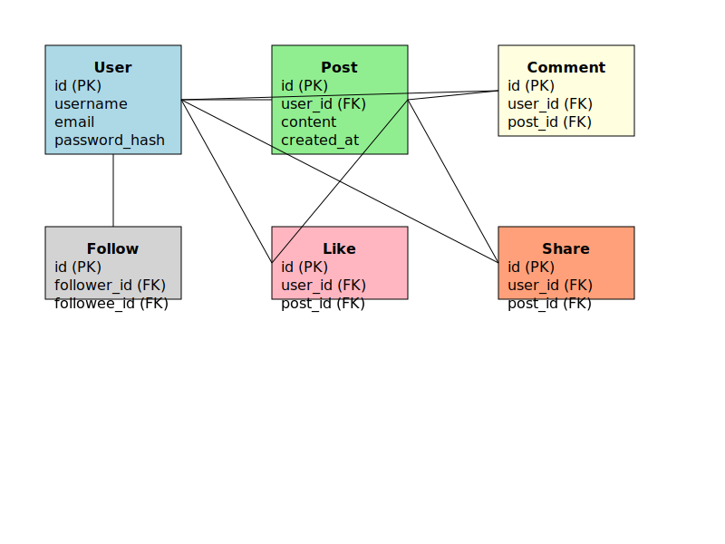

# simple_newfeed_app

Deliverables:...

1. An ERD diagram describes the DB design, field types, relationships, constraints, etc.

This ERD represents the basic structure of our newsfeed app database. Each entity (User, Post, Comment, Like, Share, Follow) is represented as a table with its key attributes and relationships.

----------

2. Create the endpoints to the app by following the SOLID principles:

--Single Responsibility Principle: Each function handles a specific task (create, read, update, delete).
--Open/Closed Principle: The code is open for extension (e.g., adding new endpoints) but closed for modification.
--Liskov Substitution Principle: Not directly applicable in this context.
--Interface Segregation Principle: Each endpoint has a specific purpose and doesn't force unwanted dependencies.
--Dependency Inversion Principle: The database connection is abstracted, allowing for easy substitution if needed.